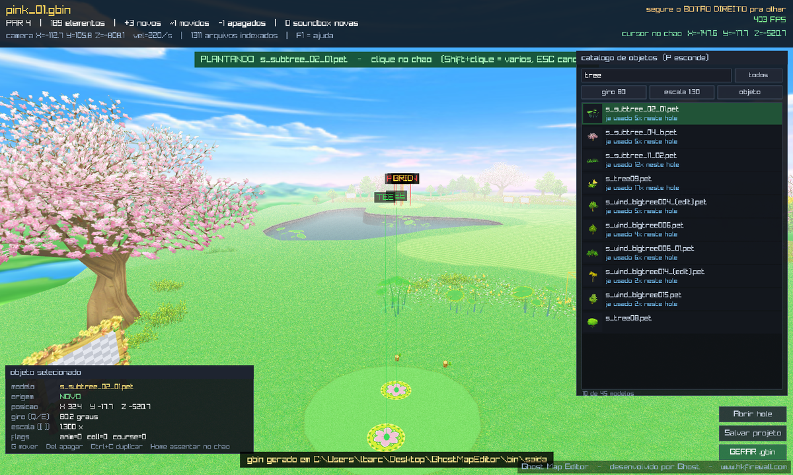

# Ghost Map Editor

Editor 3D de **posições de objetos** dos mapas (`.gbin`) do PangYa.

Não é um criador de mapas do zero: você abre um hole que já existe, voa dentro
dele em primeira pessoa, escolhe um `.pet` do catálogo e **planta, move, gira,
escala e apaga** objetos. O terreno não é tocado e nem a jogabilidade
(tee, pino, waypoints da IA e câmeras ficam intactos de propósito).



```
GhostMapEditor.exe  →  projetos\<hole>_edicao.json  →  tools\aplicar.py  →  saida\<hole>.gbin
```

---

## Rodar

Baixe/clone o repositório e execute:

```bash
bin\ABRIR_EDITOR.bat
```

Ou direto no exe, já abrindo um hole:

```bash
bin\GhostMapEditor.exe "C:\PangYa\data\round10_spring wind\map\pink_01.gbin"
```

Também dá pra **arrastar** o `.gbin` pra janela. Arrastar uma **pasta** adiciona
ela ao índice de assets na hora (útil quando falta um modelo ou uma textura).

### O que você precisa ter

| | |
|---|---|
| **Windows 64-bit** | o exe já vem compilado em `bin\` |
| **Visual C++ Redistributable 2015-2022 (x64)** | se o exe não abrir, é isso que falta — [baixar](https://aka.ms/vs/17/release/vc_redist.x64.exe) |
| **Os mapas extraídos do PangYa** | as pastas `round*` do `.pak`. **Não vêm neste repositório** |
| **Python 3 com `numpy`** no PATH | só pro botão `GERAR .gbin`. Sem ele o editor abre e edita normal, mas não escreve o mapa |
| **[pet-source_tools](https://github.com/Acrisio-Filho/pet-source_tools)** | é quem escreve o `.gbin`. Veja abaixo |

#### Apontando o `pet-source_tools`

O addon é um projeto de terceiro (Acrisio Filho) e por isso **não é
redistribuído aqui**. Baixe uma cópia e escolha uma destas formas:

1. ponha a pasta `pet-source_tools` **na raiz deste projeto** (é o que o editor procura primeiro);
2. ou crie um `pet_source_tools.txt` dentro de `bin\` com o caminho da pasta dentro;
3. ou defina a variável de ambiente `PET_SOURCE_TOOLS`.

### `editor.cfg`

Fica em `bin\editor.cfg` e é lido **sem recompilar**. As pastas listadas ali são
onde o editor procura `.pet` e textura — e são elas que formam o catálogo de
objetos. Quanto mais mapas você listar, maior o catálogo (existem cerca de
**780 `.pet` únicos** nos 15 rounds).

```ini
gbin=C:\PangYa\data\round10_spring wind\map\pink_01.gbin
asset_root=C:\PangYa\data\round10_spring wind
asset_root=C:\PangYa\data\round01_wind\ase
move_speed=220
fov=70
```

---

## Controles

| | |
|---|---|
| **botão direito segurado** | olhar em volta |
| **W A S D** / Space / Alt | andar / subir / descer |
| Shift | 3× mais rápido (e passo fino ao editar) |
| roda do mouse | velocidade da câmera |
| **clique esquerdo** | selecionar |
| **P** | mostra/esconde o catálogo |
| clique no modelo, depois no chão | **planta** |
| Shift+clique no chão | planta vários sem sair do modo |
| **G** | pega o selecionado e move com o mouse |
| setas / PageUp / PageDown | move em X-Z / em Y |
| **Q E** | gira |
| **[ ]** | escala |
| **Home** | assenta no terreno |
| **Ctrl+C** / **Del** | duplica / apaga |
| **N** | põe uma soundbox de spawn de NPC |
| Ctrl+O / Ctrl+S / **F5** | abrir / salvar projeto / gerar o `.gbin` |
| Ctrl+Z / Ctrl+Y | desfazer / refazer |
| M / K / F / L | marcadores / soundboxes / neblina / céu |
| **F1** | ajuda na tela |

---

## O que ele NÃO toca (de propósito)

**Lights de TEE e PIN, bloco MapCheck, nodes (waypoints da IA), câmeras e o
`base_element` (o terreno).** É isso que garante que a jogabilidade do hole
continua idêntica. O editor nem deixa selecionar essas coisas, e o `aplicar.py`
também não mexe nelas.

---

## Estrutura

```
GhostMapEditor/
├─ bin/                      ← a pasta que roda (é ela que você distribui)
│   ├─ GhostMapEditor.exe
│   ├─ editor.cfg            configuração, editável sem recompilar
│   ├─ ABRIR_EDITOR.bat
│   └─ tools/
│       ├─ aplicar.py        aplica o projeto e escreve o .gbin novo
│       └─ petpkg.py         carrega o pet-source_tools sem o Blender
├─ src/
│   ├─ editor/               editor_main.cpp, app.rc, ícone
│   └─ shared/               núcleo compartilhado com o Ghost Pangya SIM:
│                            viewer_core, leitores de .gbin/.pet/.dds,
│                            raycast do terreno, camadas de Win32
├─ third_party/raylib.../    raylib 6.0 (msvc, x64) — licença zlib
├─ docs/                     como funciona, portal, soundbox
└─ build.bat                 compila src/ → bin/GhostMapEditor.exe
```

`bin\tools\` precisa continuar **ao lado do exe**: é lá que o botão `GERAR .gbin`
procura o `aplicar.py`.

---

## Compilar

```bash
build.bat
```

Precisa do **Visual Studio 2022 (ou 18) Community** com o workload
"Desenvolvimento para desktop com C++". O `build.bat` acha o compilador sozinho
pelo `vswhere`. Os `.obj` vão pra `build\` e o exe é gravado direto em `bin\`.

Não precisa instalar mais nada: o raylib já vem em `third_party/`.

---

## Documentação

* [docs/COMO_FUNCIONA.md](docs/COMO_FUNCIONA.md) — a arquitetura, por que a escrita do `.gbin` mora no Python, preservação da matriz original, AABB, o modo `--shot`
* [docs/PORTAL_E_SOUNDBOX.md](docs/PORTAL_E_SOUNDBOX.md) — a receita do portal (booster) e da soundbox de NPC

---

## Créditos

* **Ghost** — [www.hkfirewall.com](https://www.hkfirewall.com) — editor
* **[Acrisio Filho](https://github.com/Acrisio-Filho/pet-source_tools)** — o `pet-source_tools`, que lê e escreve os formatos da Ntreev
* **[raylib](https://www.raylib.com)** por Ramon Santamaria — licença zlib

PangYa é marca da Ntreev Soft / NCSOFT. Este projeto é uma ferramenta
independente, feita para servidores privados e preservação; **nenhum arquivo do
jogo é distribuído aqui**.

Licença: [MIT](LICENSE).
